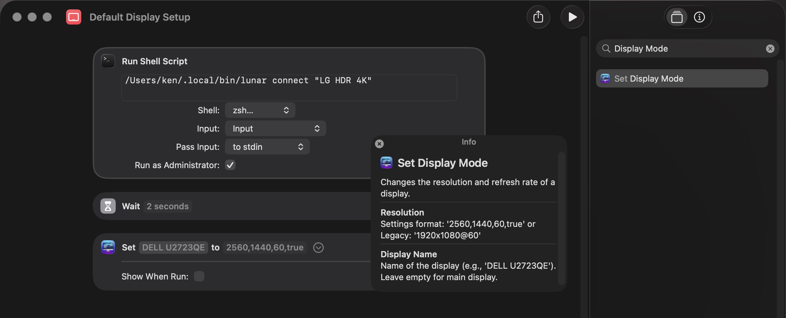
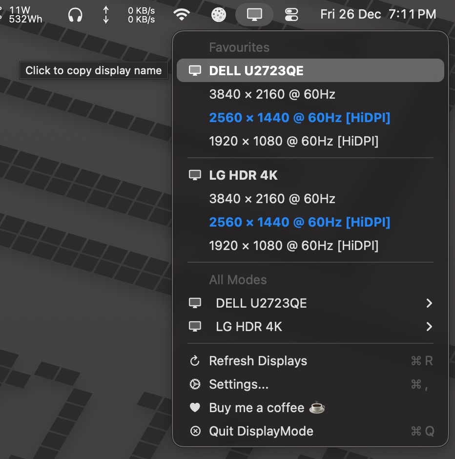

# DisplayMode Menu

A lightweight macOS menu bar app for switching display resolutions, with Shortcuts integration. Requires macOS 13+ (Ventura or later).
- **Customizable Favorites**: Configure your preferred display modes in Settings - comes with 22 default resolutions
- **Smart Display**: Current mode highlighted in bold blue, click display names to copy them
- **Per-Display Submenus**: All modes organized by display, filtered by refresh rate (≥60Hz by default)
- **Shortcuts Integration**: Dual-format support - use Settings format (`2560,1440,60,true`) or legacy (`1920x1080@60`)

> Tip: System Settings > Displays can also list resolutions (Advanced → "Show resolutions as list").
## Download & Install

**For users who don't want to build from source:**

1. **Download** the latest version [DisplayModeMenu-v0.2.zip](build/Release/DisplayModeMenu-v0.2.zip)
2. **Extract** the zip file by double-clicking it
3. **Move** `DisplayModeMenu.app` to your `/Applications` folder
4. **Allow the unsigned app** (since this app is not code-signed):
   
    **Easiest method:** Remove quarantine (one-time):
    ```bash
    xattr -cr /Applications/DisplayModeMenu.app
    ```
    Then open normally.

   **Alternative:** Use System Settings
   - Try to open the app normally (double-click)
   - macOS will block it with "cannot be opened because it is from an unidentified developer"
   - Go to **System Settings** > **Privacy & Security**
   - Scroll down to the Security section
   - Click **Open Anyway** next to the DisplayModeMenu message
   - Click **Open** in the confirmation dialog

5. **First Launch**: The 🖥️ icon will appear in your menu bar

> **Note**: This app is unsigned because it's open-source and not distributed through the Mac App Store. The source code is available for review, and you can build it yourself if preferred.
## Build on you own

**Requirements:**
- macOS 13+ (Ventura or later) for development
- Xcode 14.0+ with Swift 5.7+ support
- macOS Command Line Tools (for make commands): `xcode-select --install`

**Build Instructions:**
- Script: run [scripts/build_release.sh](scripts/build_release.sh) to build a Release app.
- Make: run `make clean release` from the repo root.
- Output: the app is written to `../displaymodemenu/build/Release/DisplayModeMenu.app`.

Example:

```bash
make clean release
```

## Using DisplayMode Menu

- Click the 🖥️ icon in the menu bar
- Favorites section (per display). Example:
  - 3840 x 2160 @ 60
  - 2560 × 1440 @ 60 [HiDPI]
  - 1920 × 1080 @ 60 [HiDPI]
- All Modes: each display has a submenu listing all modes
- Click on the resolution to change the display mode.
- Low resolution modes and minimum refresh rates can be set in the settingsfor the All Modes list
- Current mode(s) will be highlighted in bold, blue font.
- Favourites can be set in the app settings.
- Refresh Displays when displays are added or changed.


## Shortcuts Integration

The app registers a "Set Display Mode" shortcut with dual-format support.

### Setting Up a Shortcut

To create a shortcut that changes your display resolution:

1. Open the **Shortcuts** app on your Mac
2. Click **+** to create a new shortcut
3. Search for "**Set Display Mode**" in the actions list
4. Add the action to your shortcut
5. Configure the parameters:
   - **Resolution**: Enter format like `2560,1440,60,true` or `1920x1080@60`
   - **Display Name**: Leave empty for main display, or enter specific display name
6. Name your shortcut (e.g., "Switch to 2560×1440")
7. Optionally assign a keyboard shortcut in the shortcut's info panel



### Parameters

**Resolution** (required): Supports two formats:

1. **Settings Format** (recommended for copy/paste):
   - Format: `width,height,refreshRate,hiDPI`
   - Example: `2560,1440,60,true`
   - Copy directly from Settings window favorites

2. **Legacy Format** (backward compatible):
   - Format: `WIDTHxHEIGHT[@REFRESH]`
   - Example: `1920x1080@60`

**Display Name** (optional):
- Leave empty for main display (shows as "Main Display" in Shortcuts)
- For multi-display setups, use disambiguated name like `DELL U2723QE`
- **Tip**: Click on the display name in the menu to copy it to your clipboard



### Examples

**Single display (Settings format: width,height,refreshRate,hiDPI)**:
```
Resolution: 2560,1440,60,true
Display Name: (empty)
```

**Multi-display (Settings format: width,height,refreshRate,hiDPI)**:
```
Resolution: 1920,1080,60,true
Display Name: DELL U2723QE
```

**Multi-display (Legacy format: widthxheight@refreshRate)**:
```
Resolution: 1920x1080@60
Display Name: DELL U2723QE
```

**Copy/paste workflow**:
1. Open Settings window in DisplayModeMenu
2. Copy a favorite resolution line (e.g., `2560,1440,60,true`)
3. Create Shortcut with "Set Display Mode" action
4. Paste into Resolution parameter
5. Leave Display Name empty or specify display

**Tips**:
- For single-display setups, leave Display Name empty
- Tap on the Resolution or Display Name field to see helpful hints about format
- Invalid formats will show an error with examples
- Use Settings format (`2560,1440,60,true`) to copy directly from the app's Settings window
  
## Support

If you find DisplayModeMenu useful, consider buying me a coffee! ☕️

<p align="center">
  <a href="https://buymeacoffee.com/kenyc">
    
  </a>
</p>

<p align="center">
  Or visit: <a href="https://buymeacoffee.com/kenyc">buymeacoffee.com/kenyc</a>
</p>

## Credits / Origin

- This project was inspired by `displaymode` by p00ya (Apache 2.0)
- I vibe coded this implementation with a focus on a menu bar/Shortcuts experience because macOS 26 no longer list 2560x1440 as an default option for my DELL U2723QE. 

## License

- Licensed under Apache 2.0. See `LICENSE.txt`.
- Copyright 2025 Ken Ng.
